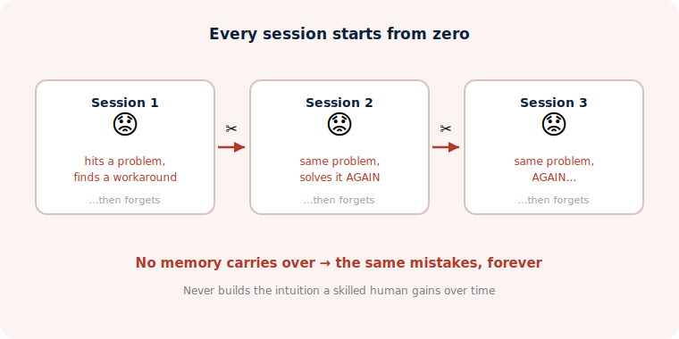
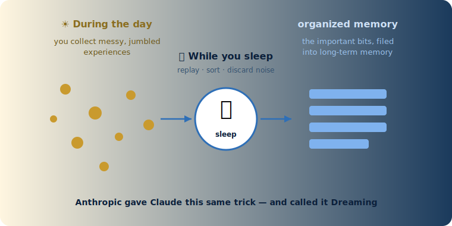
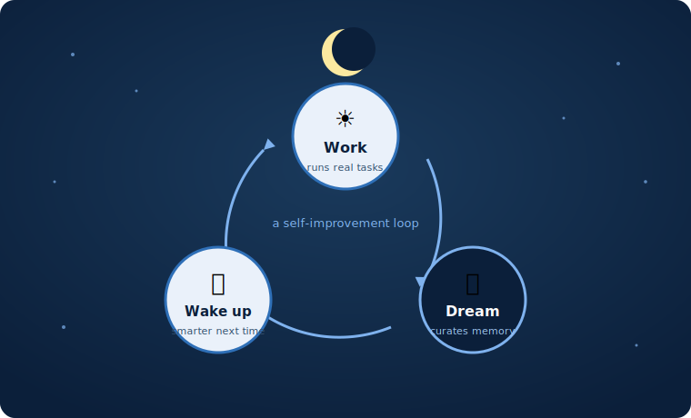
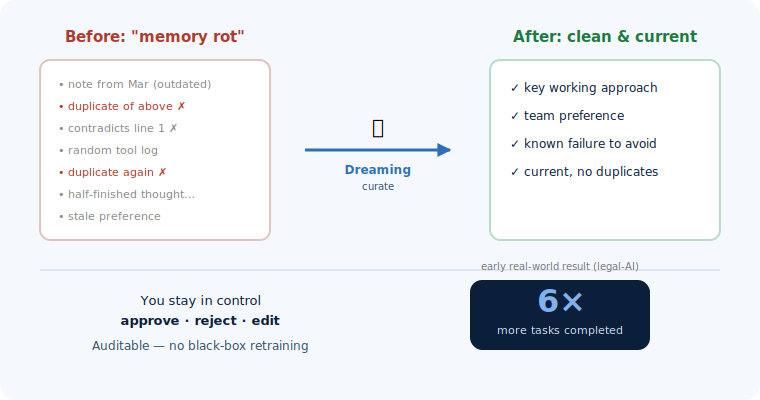

## The problem: AI agents forget {.section-title}

Most assistants start every task from a **blank slate**:

{fig-align="center" width="88%"}

## The idea: borrow from sleep {.section-title}

The brain doesn't switch off when we sleep — it **sorts the day's mess into memory**:

{fig-align="center" width="88%"}

## How Dreaming works {.section-title}

Runs while the agent is **idle** — review, curate, wake up smarter:

{.cycle-img fig-align="center" width="90%"}

## Why it matters {.section-title}

Memory becomes an **active system**, not a passive notebook:

{fig-align="center" width="74%"}

::: {.takeaway-sm}
**Takeaway:** AI is starting to learn from experience the way *we* do — by sleeping on it.
:::
